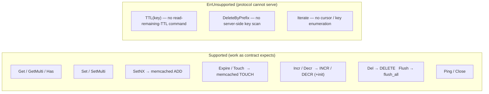
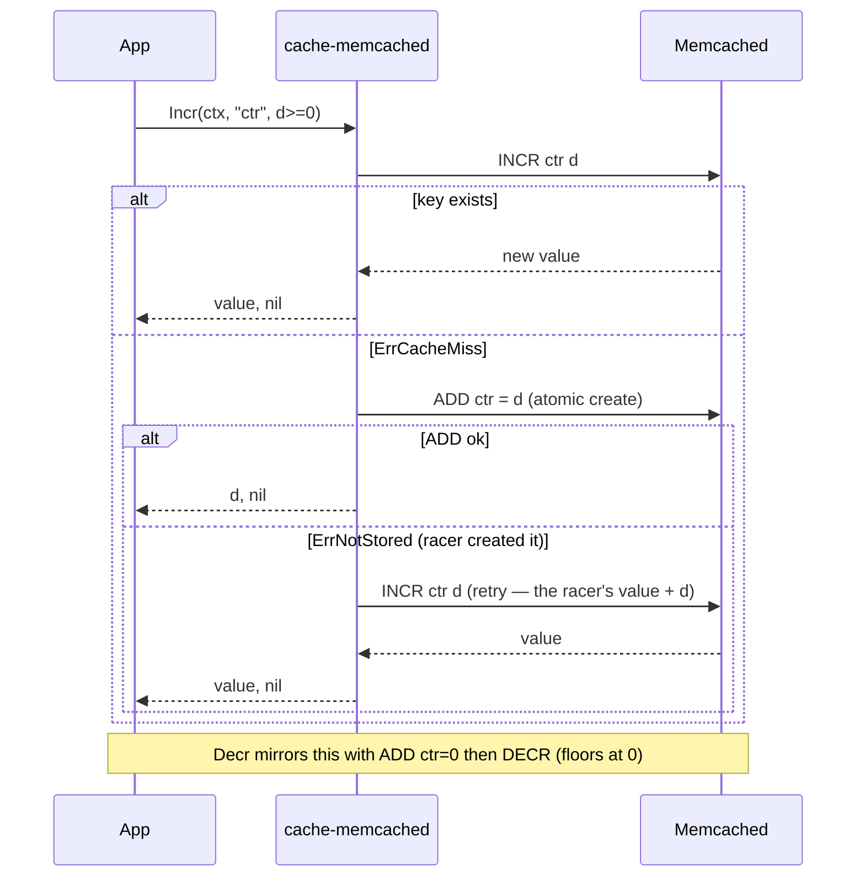

# ubgo/cache-memcached — Memcached adapter for Go


[](https://pkg.go.dev/github.com/ubgo/cache-memcached) [](https://goreportcard.com/report/github.com/ubgo/cache-memcached) [](https://github.com/ubgo/cache-memcached/actions/workflows/test.yml) [](https://github.com/ubgo/cache-memcached/actions/workflows/lint.yml)  [](https://github.com/ubgo/cache-memcached/tags) [](./LICENSE) 


Memcached adapter for Go, implementing the [`github.com/ubgo/cache`](https://github.com/ubgo/cache) contract on top of [`gomemcache`](https://github.com/bradfitz/gomemcache). It exists for **drop-in interop with an existing Memcached fleet** — and it is **partial by Memcached protocol design**, not by omission.

If you searched for "Go Memcached cache library", "gomemcache wrapper", "Memcached adapter Golang", or "use Memcached with ubgo/cache" — this is the Memcached backend of the `ubgo/cache` family. Because Memcached's wire protocol is intentionally minimal, three operations cannot be served and return `cache.ErrUnsupported`; everything else works and is unit-tested without a server.

> **Documentation:** a full per-feature cookbook with use cases, runnable snippets, and the "partial by protocol" framing for every method lives in [`docs/README.md`](docs/README.md).

## Why this adapter

- **Interop, not greenfield.** If you already run Memcached, this lets that fleet back any code written against `cache.Cache` without standing up Redis or Postgres.
- **Honest about limits.** TTL introspection, prefix delete, and key iteration are impossible over the Memcached protocol. This adapter returns an explicit `cache.ErrUnsupported` (or an iterator whose first `Next()` is false with `Err() == ErrUnsupported`) instead of faking them or silently returning empty.
- **Correct counter semantics.** Memcached counters are unsigned and decrement floors at `0`; this adapter implements the missing-key initialisation dance atomically so `Incr`/`Decr` behave per the contract (missing key = 0) within Memcached's rules.
- **Server-free tests.** A complete in-process fake exercises every supported op; `MEMCACHED_ADDR` enables optional real-server checks.

## Supported vs unsupported operations



| `cache.Cache` op | Memcached mapping | Status |
|---|---|---|
| `Get` / `GetMulti` / `Has` | `get` | works |
| `Set` / `SetMulti` | `set` | works |
| `SetNX` | `add` (`ErrNotStored` ⇒ key exists ⇒ `false`) | works |
| `Expire` / `Touch` | `touch` | works |
| `Incr` / `Decr` | `incr` / `decr` + missing-key `add` init | works (Decr floors at 0) |
| `Del` | `delete` (miss tolerated) | works |
| `Flush` | `flush_all` | works |
| `Ping` / `Close` | `version` / local flag | works |
| `TTL(key)` | — no command exists | **`ErrUnsupported`** |
| `DeleteByPrefix` | — no server-side scan | **`ErrUnsupported`** |
| `Iterate` | — no key enumeration | **`ErrUnsupported`** (iterator: `Next()`=false, `Err()`=`ErrUnsupported`) |

Because `TTL`/`DeleteByPrefix`/`Iterate` are unsupported, this adapter **does not** pass the shared `cachetest.Run` conformance suite — by protocol design. Prefer [`cache-redis`](https://github.com/ubgo/cache-redis) when you need TTL introspection or prefix operations.

## Install

```sh
go get github.com/ubgo/cache-memcached
```

Requires Go 1.24+ and a Memcached server (text or binary protocol, anything `gomemcache` speaks).

## Quick start

```go
package main

import (
	"context"
	"errors"
	"log"
	"time"

	"github.com/bradfitz/gomemcache/memcache"
	"github.com/ubgo/cache"
	memcachedcache "github.com/ubgo/cache-memcached"
)

func main() {
	mc := memcache.New("localhost:11211")
	c := memcachedcache.New(mc)
	defer c.Close()

	ctx := context.Background()
	_ = c.Set(ctx, "k", []byte("v"), time.Minute)

	b, err := c.Get(ctx, "k")
	if err != nil {
		log.Fatal(err)
	}
	log.Printf("%s", b)

	// Unsupported ops are explicit, never silent:
	if _, err := c.TTL(ctx, "k"); errors.Is(err, cache.ErrUnsupported) {
		log.Println("Memcached cannot report remaining TTL")
	}
}
```

## Constructor

### `New(mc *memcache.Client) *Cache`

Wraps a `*memcache.Client`. The adapter never closes a shared client — `Close()` only flips an idempotent local flag, after which every method returns `cache.ErrClosed`. There are intentionally no options: Memcached has no prefix/dialect/clock surface to configure.

## Method reference

```go
ctx := context.Background()

// --- Works ---
b, err := c.Get(ctx, "k")                        // ErrNotFound on miss
m, err := c.GetMulti(ctx, []string{"a", "b"})    // missing keys absent from map
ok, err := c.Has(ctx, "k")
err = c.Set(ctx, "k", []byte("v"), time.Minute)  // ttl<=0 => no expiry (Expiration 0)
err = c.SetMulti(ctx, map[string]cache.Item{"a": {Value: []byte("1")}})
created, err := c.SetNX(ctx, "k", []byte("v"), time.Minute) // ADD; false if exists
err = c.Expire(ctx, "k", time.Hour)              // TOUCH; ErrNotFound if absent
err = c.Touch(ctx, "k")                          // Expire(key, 1h)
n, err := c.Incr(ctx, "hits", 1)                 // missing key initialised to delta
n, err = c.Decr(ctx, "hits", 2)                  // floors at 0 (unsigned counter)
err = c.Del(ctx, "a", "b")                       // DELETE; miss tolerated
err = c.Flush(ctx)                               // flush_all
err = c.Ping(ctx)
err = c.Close()                                  // idempotent; does not close mc

// --- ErrUnsupported by protocol design ---
_, err = c.TTL(ctx, "k")                         // cache.ErrUnsupported
err = c.DeleteByPrefix(ctx, "user:")             // cache.ErrUnsupported
it := c.Iterate(ctx, cache.IterateOpts{})
_ = it.Next()                                    // false
_ = it.Err()                                     // cache.ErrUnsupported
```

## Counter initialisation dance

Memcached's `incr`/`decr` only operate on an **existing** key and counters are **unsigned** (decrement below zero floors at `0`). The contract says a missing key is `0`. This adapter bridges the gap atomically:



The `ADD`-then-retry handles the race where two callers both miss and try to initialise: `ADD` is atomic, so the loser observes `ErrNotStored` and re-issues the `INCR`/`DECR` against the winner's value — no lost updates, no lock.

## FAQ

### Can I use Memcached as a cache backend in Go with this?

Yes, for Get/Set/SetNX/Expire/Touch/Incr/Decr/Del/Flush/Has/Ping. It is meant for interop with an existing Memcached deployment.

### Why doesn't it pass the conformance suite?

`cachetest.Run` requires `TTL(key)`, `DeleteByPrefix`, and `Iterate`. The Memcached protocol has no command to read a key's remaining TTL, no server-side key scan, and no key enumeration. Faking them would be worse than an explicit `ErrUnsupported`, so the adapter is intentionally partial.

### What happens when I call an unsupported op?

`TTL` and `DeleteByPrefix` return `cache.ErrUnsupported`. `Iterate` returns an iterator whose first `Next()` is `false` and whose `Err()` is `cache.ErrUnsupported` — never a silent empty result.

### Why does `Decr` below zero return `0` instead of a negative number?

Memcached counters are unsigned; the server itself floors decrement at `0`. The adapter does not paper over native semantics — document and design around it, or use `cache-redis` if you need signed counters.

### Is `Incr` on a missing key safe under concurrency?

Yes. Missing-key initialisation uses atomic `ADD`; a losing racer detects `ErrNotStored` and retries the `INCR`/`DECR`, so concurrent first-writers do not lose updates.

### Does `Close()` close my Memcached client?

No. It flips an idempotent local closed flag (subsequent ops → `cache.ErrClosed`). The `*memcache.Client` is yours; it may be shared.

### How is it tested without a server?

An in-process fake implementing the minimal client interface (with Memcached semantics) drives every supported op and the counter race. Set `MEMCACHED_ADDR` to additionally run the optional real-server checks; the gate needs no server.

## Positioning vs other `ubgo/cache` adapters

| Adapter | Backing store | TTL introspection | Prefix delete | Iterate | Conformance | Best for |
|---|---|---|---|---|---|---|
| **cache-memcached** (this) | Memcached | No (unsupported) | No (unsupported) | No (unsupported) | Partial by design | Existing Memcached fleet interop |
| [cache-redis](https://github.com/ubgo/cache-redis) | Redis 6+ | Yes | Yes (`SCAN`) | Yes | Full | Shared distributed cache |
| [cache-pg](https://github.com/ubgo/cache-pg) | Postgres / SQLite | Yes | Yes (`LIKE`) | Yes | Full | Durable cache on Postgres |
| [cache-tiered](https://github.com/ubgo/cache-tiered) | composes others | via tiers | via tiers | via tiers | Full | L1/L2 hot-path latency |

## Contributing

See [CONTRIBUTING.md](./CONTRIBUTING.md) for the build/test/lint gate, why this adapter is intentionally partial, and the in-process fake test setup.
